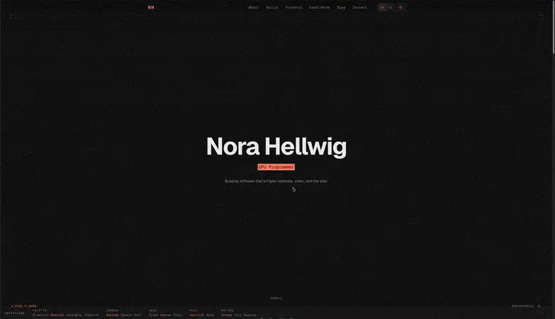
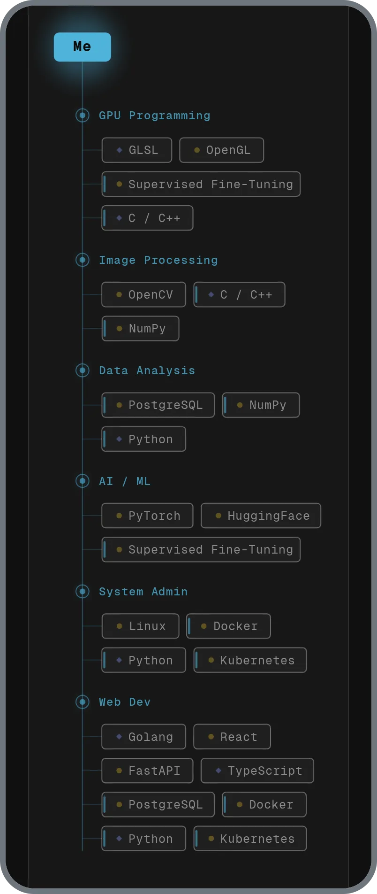
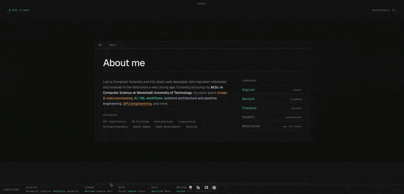
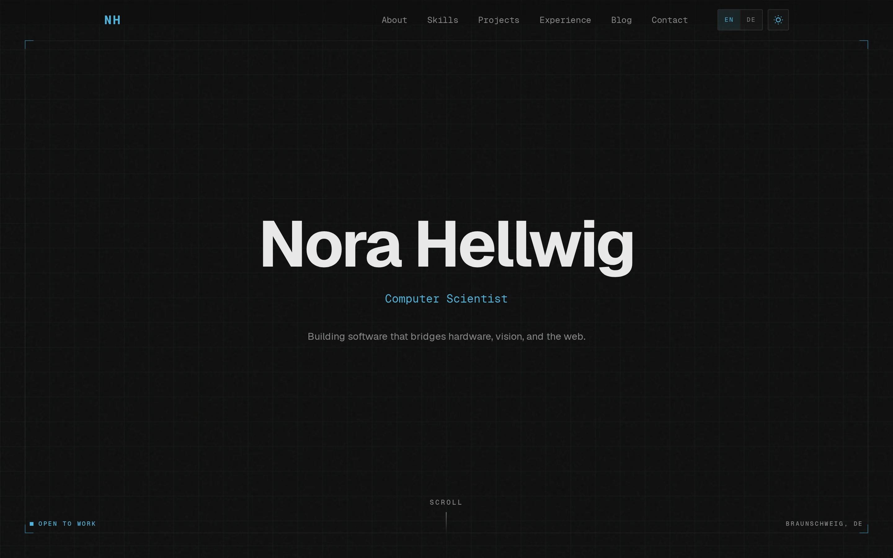
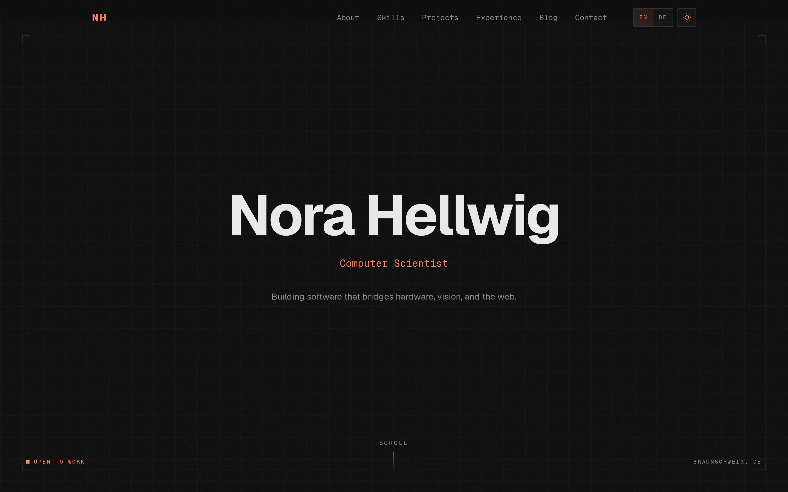
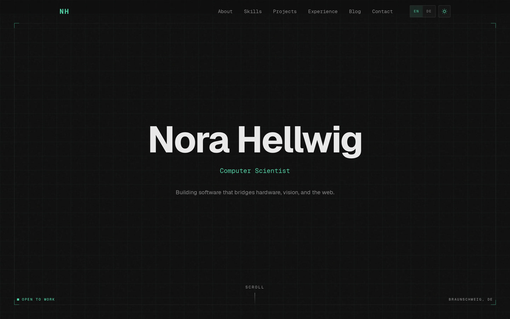
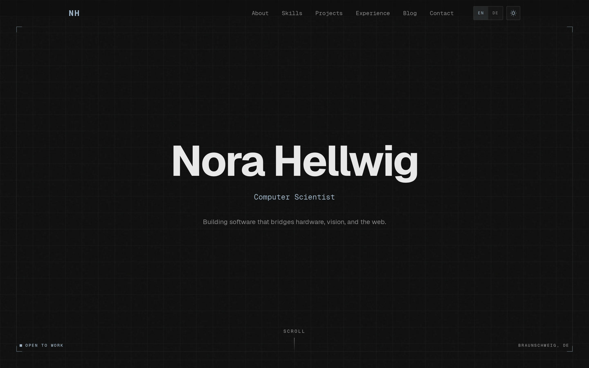
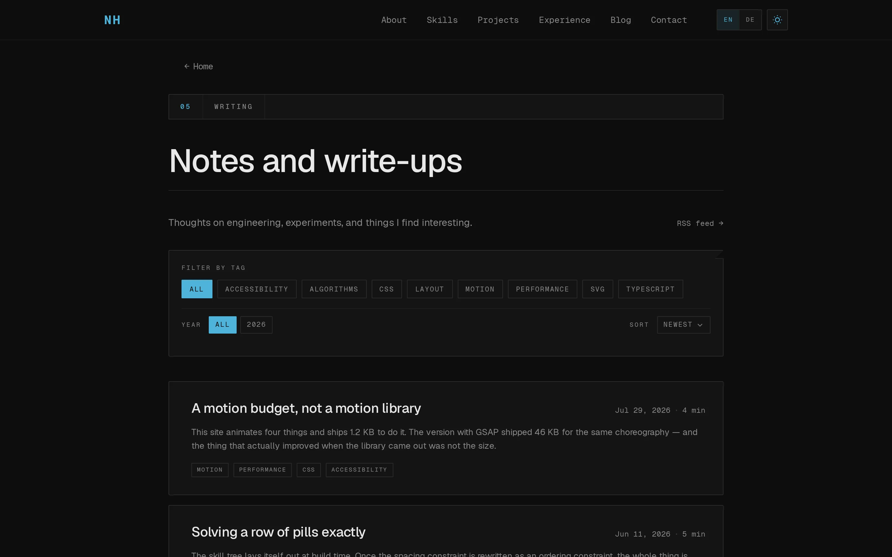
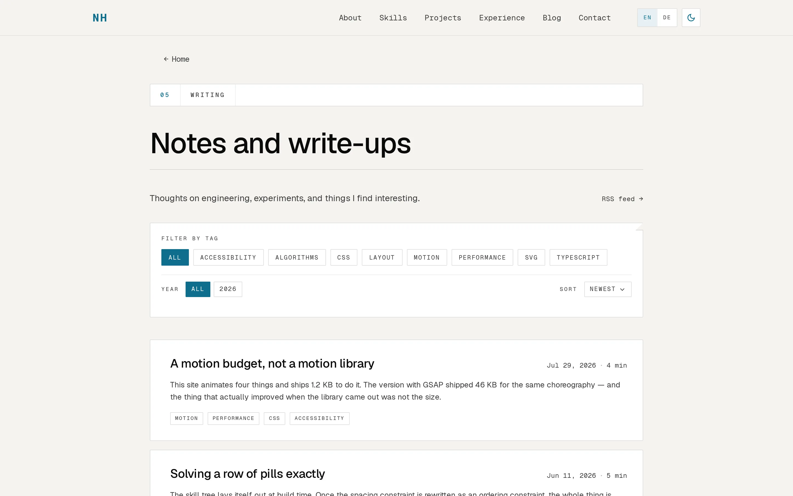
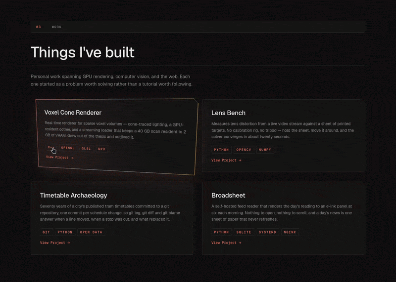

# Blueprint

An Astro 5 portfolio, blog and interactive skill tree, styled as an engineer's
drafting set.

[](https://github.com/emrexcem/blueprint/actions/workflows/ci.yml)
[](https://github.com/emrexcem/blueprint/actions/workflows/pages.yml)
[](LICENSE)


**[See the demo →](https://emrexcem.github.io/blueprint/)** — rebuilt from `main`
on every push.



---

Every section is a *sheet*, opened by a ruled *title block* carrying its number
and name, like `04 | HISTORY`. Four devices carry meaning rather than decorate:

| Device | Means |
|---|---|
| Title block | this is sheet *n* of the set |
| Clipped corner notch | this plate is interactive |
| Left accent edge | this leads somewhere |
| Hairline | section boundary |

Because they mean something, they are used sparingly. A plate is never drawn
inside a plate, exactly one band on the page is tinted, and the title block's
empty right-hand cells stay empty.

## The skill tree


The layout is solved at build time. A skill's tier is the number of domains it
feeds, and that picks its row. Within a row, every pill wants to sit at the
centroid of the domains it connects to, subject to a minimum gap between
neighbours. That is isotonic regression, solved exactly in one
pool-adjacent-violators pass, so two pills in a row cannot collide. There is no
relaxation loop or threshold to tune, and the build re-checks every pair on the
rounded numbers that actually ship.

On a desktop it is a spring simulation. Drag a skill and its ropes stretch,
change colour under strain, and snap; drag it far enough and it pops. Cut ropes
heal on their own. One fixed-timestep RAF loop writes straight to the DOM, and
React re-renders only on a discrete event like a snap or a reform.

A panel in the corner exposes the constants live: spring, damping, break
threshold, heal rate, sound, and a reset. It ships in every build, not just the
demo.

<table>
<tr>
<td width="260" valign="top">



</td>
<td valign="top">

Below 900px a different composition is drawn from the same generated data: a
vertical spine, domains hanging off it, skills in wrapped rows. The landscape
drawing is 2340 units wide and would render its labels at about 5px in a phone
column.

A skill that feeds two domains appears under both, marked with the accent edge.
Tapping any copy lights every copy and each domain it feeds, which stands in for
hovering on a desktop.

</td>
</tr>
</table>

Pill widths are computed rather than measured: `characters × size × 0.6`, the
mono's advance ratio. That is why the whole layout solves in Node with no
browser in the loop.

## Variations

Four palettes and four treatment axes ship as token blocks in one stylesheet,
selected by a `data-*` attribute on `<html>`.



The demo carries that rail and switches all of it live, with no reload. It ships
in no fork: it sits behind a build flag that is off by default, and CI fails the
build if a single byte of it reaches the output.

| Blueprint (cyan) | Redline (vermilion) |
|---|---|
|  |  |
| **Verdigris (patinated green)** | **Graphite (steel grey)** |
|  |  |

All 24 accent colours clear WCAG AA against the page, a plate and the tinted
band in their own mode. The measured ratio sits in a comment beside each one,
and the lowest is 5.62:1.

## Light and dark

| Dark | Light |
|---|---|
|  |  |

The theme is applied before first paint, so there is no flash. With nothing
stored the site follows the operating system and keeps following it if you
change it mid-visit; using the toggle is what makes it a choice.

Light mode has its own palette rather than an inversion. The accents are
separately darkened to clear AA on paper, and the tinted band goes darker than
the page so it still reads as the table under the sheet.

## Also in the box

- **A blog** with MDX, [Expressive Code](https://expressive-code.com/), reading
  time, tag filtering, RSS, a sitemap, per-post social cards drawn at build time
  in your own palette, and optional [giscus](https://giscus.app) comments.
- **Two languages.** English unprefixed, German at `/de/`, both statically built
  with their own `<html lang>`, canonical and hreflang. The German dictionary is
  typed as `typeof en`, so a missing translation is a compile error.
- **A projects grid** whose cards tilt in 3D under a fine pointer and go flat on
  a touch screen.



## Worth knowing

- **No animation library.** The islands use about 1.2 KB gzipped of hand-written
  helpers (an in-view trigger, an entrance, a delayed unmount) plus CSS. GSAP
  core with ScrollTrigger measured 46 KB for the same choreography.
- **CSS never hides content that JS later reveals.** Entrance states are applied
  at runtime, so with JavaScript off you get the finished page. An entrance also
  only hides what is still below the fold: the page motion and the islands both
  measure first and skip anything already on screen.
- **One motion predicate.** Everything that decides whether to animate calls the
  same function, so `prefers-reduced-motion` cannot be honoured in one place and
  forgotten in another.
- **Focus is one rule.** One ink, a 3px outset offset. The offset puts a gap of
  surface between the element and the mark, so the ring only has to clear 3:1
  against the surface and one colour works everywhere.
- **Fonts are subset from the built HTML.** The character set comes from every
  codepoint in the emitted pages, plus an ASCII and Latin-1 floor. 590 KB of
  source faces ship as 183 KB.

## Quick start

Use this template on GitHub, or:

```bash
npx degit emrexcem/blueprint my-site
cd my-site
npm install
npm run dev
```

The dev server is at `localhost:4321`, with the variation rail on.

If you already know which palette you want, the
[latest release](https://github.com/emrexcem/blueprint/releases/latest) carries
each of the four as its own download — a source starter with the palette already
set, and a built static site for hosts where you would rather not run a build.

[`src/config.ts`](src/config.ts) is the whole site, in order down the file:

| Export | What it is |
|---|---|
| `site` | your name, location, and the contact rows |
| `theme`, `values` | which palette and treatments ship, and the continuous knobs |
| `comments` | giscus, blank until you fill it in |
| `about` | the bio, its emphasis runs, interests, languages |
| `projects` | the grid |
| `experience` | the ledger: dates, entry types, prose |
| `domains`, `skills` | the skill tree |

Then `src/styles/global.css` for colour. Nothing else needs editing to publish a
site: no component holds content, and the projects grid, the experience ledger
and the skill tree all read from that one file.

Content that differs per language carries its own `en` and `de` on each entry,
so adding a project or a job is one object in one place and its prose cannot
attach to the wrong entry. `src/i18n/ui.ts` is separate on purpose: that is the
theme's own chrome (nav labels, section headings, the legend), which you mostly
leave alone.

## Customising

### Colour

Edit `src/styles/global.css` and nothing else. Each accent is written twice, as
a hex and as a bare `r g b` triplet, because the tints across the site (the
grid, card glows, code chips) are `rgb(var(--…-rgb) / a)`. Change both in the
same edit.

No other file states a colour. The skill tree resolves token *names* at runtime,
and the social-card route reads your configured palette out of the stylesheet at
build time.

### Variation settings

`src/config.ts` holds two kinds of variation setting.

Presets, the `theme` export, are named and discrete. Each value is a token block
in `global.css`, and the demo's rail switches between exactly these:

| Setting | Values |
|---|---|
| `palette` | `blueprint` · `redline` · `verdigris` · `graphite` |
| `corner` | `notched` · `square` · `soft` |
| `grid` | `ruled` · `coarse` · `plain` |
| `rule` | `hairline` · `bold` |
| `motion` | `system` · `full` · `reduced` |

Edit them in the file, or set them from the command line — handy in a script,
and it validates the value against the union rather than letting a typo reach a
build:

```bash
npm run preset -- palette=redline
npm run preset -- palette=graphite corner=square grid=plain
```

Values, the `values` export, are continuous: `noiseOpacity`, `parallaxDepth`,
`tiltMaxDeg`. Hand-edit these; nothing switches them at runtime, and the demo's
rail has no slider for them.

Adding a palette is one block per mode in `global.css` plus one member of the
`Palette` union. Two rules keep the system from spreading: no component may
branch on a variation attribute, and a knob and a preset must never name the
same CSS variable, because the knobs land as an inline style on `<html>` and
outrank every preset block.

Where the control rail appears is one setting, `SHOWCASE`:

| Build | Rail |
|---|---|
| `npm run dev` | on |
| `npm run build` | **off**, which is what a fork ships |
| the Pages demo (`SHOWCASE=1`) | on |

Off means absent. The component's styles and script are inline, so nothing of it
reaches a default build, and CI greps the output to prove it.

### Adding to the skill tree

Edit `domains` and `skills` in `src/config.ts`, then `npm run layout`. A skill
listed under two domains is drawn with the accent edge and lights both when
hovered.

A new *kind* needs three things: a member of the `SkillKind` union in
`src/data/tree-layout.ts`, one entry in `KINDS` (colour token and glyph), and a
legend label in both languages.

### Adding a post

Drop a `.md` or `.mdx` file in `src/content/blog/` with `title`, `description`,
`date`, `tags` and `draft` frontmatter. `draft: true` excludes it from the build
entirely. The layout owns the `h1`, so you do not write one. For an image
caption, put the italic line directly under the image with no blank line
between, which is what the caption styling keys on.

### Comments

The `comments` export ships blank, which omits the section entirely. Fill in
`repo`, `repoId`, `category` and `categoryId` from [giscus.app](https://giscus.app)
to turn it on.

A post is one document in both languages, and only the furniture around it
translates, so the two language versions share a single comment thread by
design.

### Removing German

Deleting the `de` dictionary is not enough. Six places participate, and the
build will otherwise tell you about them one at a time:

1. `src/i18n/ui.ts` — delete the `de` object, and drop `"de"` from `LOCALES` and
   from the `Lang` union.
2. `src/config.ts` — delete the `de` key from every entry that has one. `pick()`
   falls back to `en`, so this is tidying rather than a fix.
3. `src/pages/de/` — delete the directory.
4. `astro.config.mjs` — remove the `i18n` block and the `i18n` option passed to
   `sitemap()`.
5. `src/components/astro/LangSwitch.astro` — delete it, and its use in
   `Navbar.astro`.
6. `src/layouts/BaseLayout.astro` — the `alternates` block and the
   `og:locale:alternate` tags become a no-op; remove them.

`getLang`, `useTranslations` and `localizePath` all still work with one locale,
and every string stays in one file rather than scattered through the markup.
Adding a third language is the same list in reverse, plus a `src/pages/<code>/`
directory of one-line route wrappers.

## Deploying

`SITE_URL` is the origin and `BASE_PATH` is the subdirectory. They are separate
so the base is never written twice.

**GitHub Pages** works out of the box. Enable Pages with "GitHub Actions" as the
source; `.github/workflows/pages.yml` derives both values from the repository
name, so a fork gets a correct build with no edit. That includes the case where
the repository is named `<owner>.github.io` and is served from the root.

**Anywhere else** is a static build:

```bash
SITE_URL=https://your-domain.example npm run build
```

`dist/` is the whole site. There is no server component.

## Verification

There is no test runner. `npm run build` does the checking:

- `prebuild` regenerates the skill-tree layout and asserts that every pair of
  nodes clears its gap, on the emitted rounded numbers.
- `postbuild` subsets the fonts and asserts that the mono's advance ratio, the
  glyph advances and the ligature shaping are all unchanged.

Both exit non-zero on failure. `npm run check` runs `astro check` and is
stricter than the build. CI runs both, plus a build under a subpath so base-path
handling cannot silently regress.

## Fonts

Self-hosted [Geist and Geist Mono](https://vercel.com/font), both
[SIL OFL 1.1](public/fonts/geist/OFL.txt). No web-font CDN.

One constraint if you swap the mono: skill-tree pill widths are computed from
the advance ratio, so a mono whose ratio is not exactly 0.6 mis-sizes every pill
in the tree. The build asserts it and fails.

JetBrains Mono and IBM Plex Mono are also exactly 0.6. Watch Roboto Mono, where
1229/2048 = 0.600098, which reads as 0.6 and is not. See
[`public/fonts/README.md`](public/fonts/README.md).

## Licence

[MIT](LICENSE) for the code; the fonts carry their own licence, above. The demo
content (the persona, the projects and the two posts) is placeholder material
written for this template. Replace it.
